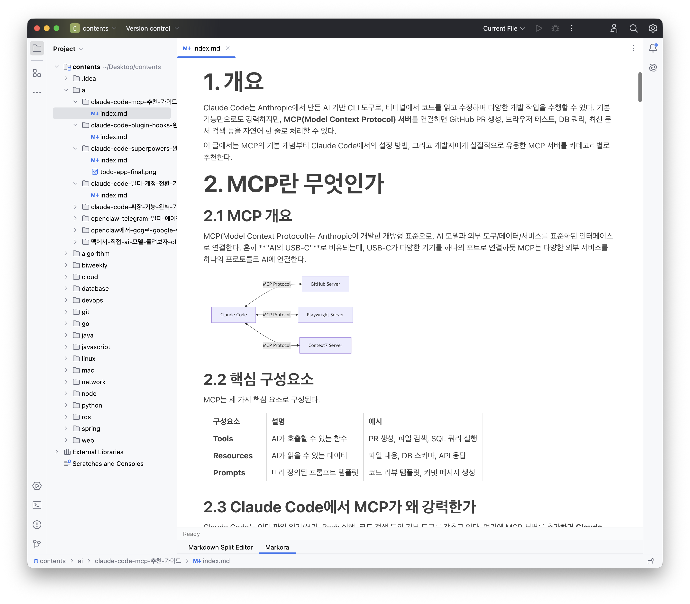

# Markora

A WYSIWYG Markdown editor plugin for JetBrains IDEs.

Markora brings a distraction-free, rich visual Markdown editing experience directly into your JetBrains IDE. Edit Markdown files with real-time rendering — no split pane, no preview panel, just seamless WYSIWYG editing.



## Features

- **WYSIWYG Editing** — Notion-style block editor powered by [BlockNote](https://www.blocknotejs.org/)
- **Block UX** — Drag handle, slash menu (`/`), block transforms, inline formatting
- **Theme Sync** — Automatically matches your IDE's Dark/Light theme
- **Auto-Save** — Changes are saved automatically with a configurable debounce delay
- **Image Support** — Drag & drop or paste images from clipboard; stored in a local `images/` directory with relative paths
- **LaTeX Math** — Inline (`$...$`) and block (` ```math `) math rendering via KaTeX
- **Mermaid Diagrams** — Render flowcharts, sequence diagrams, gantt charts, and more (` ```mermaid `)
- **External Links** — Links open in your system browser

## Slash Commands

Type `/` in the editor to access BlockNote's default block menu (heading, list, quote, code, table, image, etc.) plus Markora-specific items:

| Command | Description |
|---------|-------------|
| `/math` | LaTeX math block (` ```math `) |
| `/equation` | Inline LaTeX (`$...$`) |
| `/mermaid` | Mermaid diagram block (` ```mermaid `) |

For the full list of standard blocks, see [BlockNote documentation](https://www.blocknotejs.org/docs/editor-basics/default-schema).

## Requirements

- **JetBrains IDE** 2024.2 or later (IntelliJ IDEA, WebStorm, PyCharm, GoLand, etc.)
- **JCEF support** (enabled by default in most JetBrains IDEs)

## Installation

### From JetBrains Marketplace

1. Open **Settings** > **Plugins** > **Marketplace** (or visit the [Marketplace listing](https://plugins.jetbrains.com/plugin/31598-markora) directly)
2. Search for **Markora**
3. Click **Install** and restart your IDE

### Manual Installation

1. Download the latest release from [GitHub Releases](https://github.com/kenshin579/markora/releases)
2. Open **Settings** > **Plugins** > **Gear icon** > **Install Plugin from Disk...**
3. Select the downloaded `.zip` file and restart your IDE

## Usage

1. Open any `.md` file in your JetBrains IDE
2. Select the **Markora** editor tab (appears alongside the default editor)
3. Start editing in WYSIWYG mode

## Settings

Configure the plugin at **Settings** > **Tools** > **Markora**:

| Setting | Description | Default |
|---------|-------------|---------|
| Font Size | Editor font size (px) | 16 |
| Auto-Save Delay | Save debounce time (ms) | 1000 |

## Building from Source

```bash
# Clone the repository
git clone https://github.com/kenshin579/markora.git
cd markora

# First build downloads Node 20.18.0 to .gradle/nodejs/ (managed by gradle-node-plugin).
# No system Node required.

# Build the plugin
./gradlew build

# Run IDE sandbox with the plugin loaded
./gradlew runIde

# Package the plugin for distribution
./gradlew buildPlugin
```

**Prerequisites**: JDK 21

## Tech Stack

- **Kotlin** — Plugin source code
- **IntelliJ Platform SDK** — IDE integration
- **JCEF** (Chromium Embedded Framework) — Web-based editor rendering
- **BlockNote** — Notion-style React block editor
- **Vite + React** — Frontend bundle pipeline
- **KaTeX** — LaTeX math rendering
- **Mermaid** — Diagram rendering

## Contributing

Contributions are welcome! Please feel free to submit a Pull Request.

1. Fork the repository
2. Create your feature branch (`git checkout -b feature/amazing-feature`)
3. Commit your changes (`git commit -m 'Add amazing feature'`)
4. Push to the branch (`git push origin feature/amazing-feature`)
5. Open a Pull Request

## License

This project is open source. See the [LICENSE](LICENSE) file for details.
