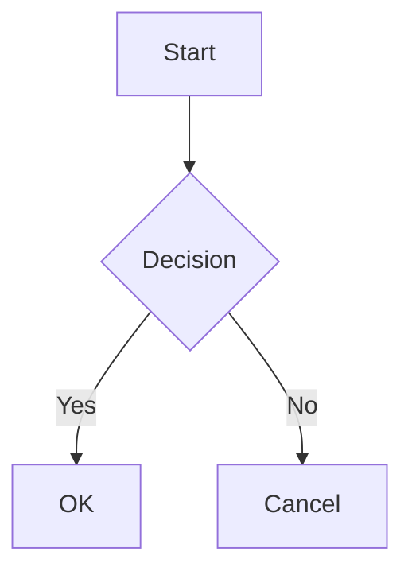

# MVP PRD: IntelliJ Markdown WYSIWYG Editor Plugin

## 1. 개요

### 1.1 프로젝트 정보

| 항목 | 내용 |
|------|------|
| 프로젝트명 | IntelliJ Markdown WYSIWYG Editor |
| 저장소 | https://github.com/kenshin579/intellij-plugin-markdown-editor |
| 플랫폼 | JetBrains IntelliJ Platform (모든 JetBrains IDE 지원) |
| 언어 | Kotlin |
| 최소 IDE 버전 | 2024.2+ (JDK 21 필수) |

### 1.2 비전

> Typora처럼 마크다운 에디터인지 모르는 편집기

마크다운 문법이 보이지 않는 **완전한 WYSIWYG 경험**을 JetBrains IDE 안에서 제공한다.
사용자가 `#`, `**`, `` ``` `` 같은 마크다운 문법을 입력하면 즉시 렌더링된 형태로 전환되어,
마크다운을 모르는 사용자도 자연스럽게 사용할 수 있는 에디터를 목표로 한다.

### 1.3 참고 프로젝트

| 프로젝트 | 설명 | 참고 포인트 |
|-----------|------|-------------|
| [Typora](https://typora.io/) | 데스크톱 WYSIWYG 마크다운 에디터 | UX 벤치마크 - 실시간 렌더링, Focus/Typewriter 모드 |
| [shuzijun/markdown-editor](https://github.com/shuzijun/markdown-editor) | IntelliJ 마크다운 에디터 플러그인 | 기술 아키텍처 참고 - JCEF + Vditor 기반 |

---

## 2. 핵심 요구사항

### 2.1 뷰 모드

| 모드 | 설명 | 우선순위 |
|------|------|----------|
| **라이브 렌더링 (기본)** | 마크다운 문법 입력 즉시 렌더링. 모든 블록이 항상 렌더링된 상태로 표시 | **P0** |
| **소스 모드** | 순수 마크다운 텍스트 편집 모드 | **P0** |

- 에디터 하단 탭 또는 툴바 버튼으로 모드 전환
- 기본 모드는 **라이브 렌더링**으로 설정

### 2.2 Slash 커맨드 (Notion 스타일)

Notion과 동일하게, `/`를 입력하면 **커맨드 팔레트**가 표시되고 카테고리별로 블록을 삽입할 수 있다.

> **참고**: Notion Slash 커맨드 — https://www.notion.com/help/keyboard-shortcuts

#### 2.2.1 UX 동작

- `/` 입력 시 **카테고리별 그룹화된 드롭다운 팝업** 표시
- 타이핑으로 필터링 (예: `/h` → 제목 관련 커맨드만 표시)
- 키보드 `↑↓`로 탐색, `Enter`로 선택, `Esc`로 취소
- 마크다운 문법 직접 입력도 동일하게 동작 (예: `# ` 입력 → 제목 스타일로 전환)
- 빈 줄뿐 아니라 **줄 시작 위치 어디서든** `/` 입력으로 호출 가능

#### 2.2.2 Basic Blocks

| 커맨드 | Notion 동일 | 동작 | 우선순위 |
|--------|:-----------:|------|----------|
| `/text` 또는 `/plain` | Y | 일반 텍스트 블록 생성 | **P0** |
| `/h1` 또는 `/#` | Y | 대제목 (H1) | **P0** |
| `/h2` 또는 `/##` | Y | 중제목 (H2) | **P0** |
| `/h3` 또는 `/###` | Y | 소제목 (H3) | **P0** |
| `/bullet` | Y | 비순서 목록 | **P0** |
| `/num` | Y | 순서 목록 | **P0** |
| `/todo` | Y | 체크리스트 (체크박스) | **P0** |
| `/toggle` | Y | 토글 리스트 (접기/펼치기) | P1 |
| `/quote` | Y | 인용 블록 | **P0** |
| `/div` | Y | 구분선 (`---`) | **P0** |
| `/link` | Y | 다른 문서 링크 | P2 |

#### 2.2.3 Inline

| 커맨드 | Notion 동일 | 동작 | 우선순위 |
|--------|:-----------:|------|----------|
| `/equation` | Y | 인라인 LaTeX 수식 (`$...$`) | P1 |
| `/emoji` | Y | 이모지 선택 팝업 | P2 |

#### 2.2.4 Media

| 커맨드 | Notion 동일 | 동작 | 우선순위 |
|--------|:-----------:|------|----------|
| `/image` | Y | 이미지 삽입 (업로드/경로 지정) | **P0** |
| `/code` | Y | 코드 블록 (언어 선택 드롭다운) | **P0** |
| `/table` | - | 표 삽입 (행/열 지정 다이얼로그) | **P0** |

#### 2.2.5 Advanced

| 커맨드 | Notion 동일 | 동작 | 우선순위 |
|--------|:-----------:|------|----------|
| `/math` 또는 `/latex` | Y | LaTeX 수식 블록 (`$$...$$`) | P1 |
| `/mermaid` | - | Mermaid 다이어그램 블록 | P1 |
| `/toc` | Y | 목차 (Table of Contents) 자동 생성 | P1 |
| `/duplicate` | Y | 현재 블록 복제 | P2 |
| `/delete` | Y | 현재 블록 삭제 | P2 |

#### 2.2.6 Turn Into (블록 변환)

Notion의 `/turn` 커맨드와 동일하게, 기존 블록을 다른 타입으로 변환한다.

| 커맨드 | 동작 | 우선순위 |
|--------|------|----------|
| `/turntext` | 일반 텍스트로 변환 | P2 |
| `/turnh1` ~ `/turnh3` | 제목으로 변환 | P2 |
| `/turnbullet` | 비순서 목록으로 변환 | P2 |
| `/turnnum` | 순서 목록으로 변환 | P2 |
| `/turntodo` | 체크리스트로 변환 | P2 |
| `/turnquote` | 인용으로 변환 | P2 |
| `/turncode` | 코드 블록으로 변환 | P2 |

#### 2.2.7 커맨드 팔레트 UI

```
┌─────────────────────────────────┐
│  / h                       ✕   │  ← 입력 필터
├─────────────────────────────────┤
│  BASIC BLOCKS                   │  ← 카테고리 헤더
│  ┌───┐                          │
│  │ H1│  Heading 1         /#    │  ← 아이콘 + 이름 + 단축키
│  └───┘                          │
│  ┌───┐                          │
│  │ H2│  Heading 2         /##   │
│  └───┘                          │
│  ┌───┐                          │
│  │ H3│  Heading 3         /###  │
│  └───┘                          │
├─────────────────────────────────┤
│  MEDIA                          │
│  ...                            │
└─────────────────────────────────┘
```

- 각 항목: **아이콘 + 커맨드명 + 설명 + 키보드 단축키**
- 카테고리별 그룹화 (Basic, Inline, Media, Advanced)
- 현재 입력에 따른 실시간 필터링

### 2.3 마크다운 요소 지원

#### 2.3.1 기본 텍스트 서식 (P0)

| 요소 | 마크다운 문법 | 렌더링 동작 |
|------|---------------|-------------|
| 제목 (H1~H6) | `# ~ ######` | 입력 즉시 제목 스타일 적용 |
| 볼드 | `**text**` | 굵은 글씨로 표시 |
| 이탤릭 | `*text*` | 기울임 글씨로 표시 |
| 취소선 | `~~text~~` | 취소선 표시 |
| 인라인 코드 | `` `code` `` | 코드 스타일 표시 |
| 링크 | `[text](url)` | 클릭 가능한 링크 표시 |
| 인용 | `> text` | 인용 블록 스타일 |
| 구분선 | `---` | 수평선 렌더링 |
| 목록 | `- `, `1. ` | 들여쓰기 목록 |

#### 2.3.2 체크리스트 (P0)

```markdown
- [ ] 미완료 항목
- [x] 완료 항목
```

- 체크박스 클릭으로 상태 토글
- 마크다운 소스 자동 동기화 (`[ ]` <-> `[x]`)

#### 2.3.3 코드 블록 (P0)

````markdown
```python
def hello():
    print("Hello, World!")
```
````

- **Syntax Highlighting**: 주요 언어 지원 (Python, Java, Kotlin, JavaScript, TypeScript, Go, Rust, SQL, YAML, JSON, Bash 등)
- 언어 선택 드롭다운
- 줄 번호 표시 (옵션)

#### 2.3.4 표 (P0)

```markdown
| Header 1 | Header 2 |
|----------|----------|
| Cell 1   | Cell 2   |
```

- 비주얼 테이블 편집 (셀 클릭으로 편집)
- 행/열 추가/삭제 (컨텍스트 메뉴 또는 버튼)
- 드래그로 열 너비 조정

#### 2.3.5 이미지 삽입 (P0)

| 방법 | 설명 |
|------|------|
| 드래그 & 드롭 | 파일을 에디터에 드롭 |
| 클립보드 붙여넣기 | 스크린샷 Ctrl+V 삽입 |
| Slash 커맨드 | `/image`로 파일 선택 다이얼로그 |
| 마크다운 문법 | `` 직접 입력 |

- 이미지는 프로젝트 내 상대 경로로 저장
- 인라인 프리뷰 렌더링
- 이미지 리사이즈 지원 (드래그)

#### 2.3.6 수식 - LaTeX (P1)

**인라인 수식**: `$E = mc^2$`
**블록 수식**:
```markdown
$$
\sum_{i=1}^{n} x_i = x_1 + x_2 + \cdots + x_n
$$
```

- KaTeX 또는 MathJax 기반 렌더링
- 실시간 프리뷰

#### 2.3.7 다이어그램 - Mermaid (P1)

````markdown

````

- Mermaid.js 기반 렌더링
- 지원 다이어그램: Flowchart, Sequence, Gantt, Class, State, Pie, ER

---

## 3. 기술 아키텍처

### 3.1 아키텍처 개요

```
┌─────────────────────────────────────────────┐
│              JetBrains IDE                   │
│  ┌───────────────────────────────────────┐   │
│  │      FileEditorProvider (Kotlin)      │   │
│  │  - .md 파일 감지 및 에디터 탭 등록      │   │
│  └──────────────┬────────────────────────┘   │
│                 │                             │
│  ┌──────────────▼────────────────────────┐   │
│  │        JCEF Browser Panel             │   │
│  │  ┌─────────────────────────────────┐  │   │
│  │  │   Web-based WYSIWYG Editor      │  │   │
│  │  │   (Vditor / Milkdown / Custom)  │  │   │
│  │  │                                 │  │   │
│  │  │  - 라이브 렌더링                  │  │   │
│  │  │  - Slash 커맨드 UI               │  │   │
│  │  │  - Mermaid / KaTeX 렌더링        │  │   │
│  │  └─────────────────────────────────┘  │   │
│  └──────────────┬────────────────────────┘   │
│                 │ JS ↔ Kotlin Bridge          │
│  ┌──────────────▼────────────────────────┐   │
│  │      Backend Controllers (Kotlin)     │   │
│  │  - 파일 읽기/쓰기                      │   │
│  │  - 이미지 업로드                       │   │
│  │  - 설정 관리                           │   │
│  └───────────────────────────────────────┘   │
└─────────────────────────────────────────────┘
```

### 3.2 기술 스택

| 계층 | 기술 | 설명 |
|------|------|------|
| JDK | **JDK 21** | IntelliJ 2024.2+ 필수 (JetBrains Runtime 21 기반) |
| Plugin Framework | IntelliJ Platform SDK | FileEditorProvider, Actions, Services |
| 언어 | Kotlin | 플러그인 코드 전체 |
| 빌드 | Gradle + IntelliJ Platform Plugin | 빌드, 테스트, 패키징 |
| 브라우저 엔진 | JCEF (Chromium Embedded Framework) | 웹 기반 에디터 렌더링 |
| 에디터 라이브러리 | **후보 평가 필요** (아래 참조) | WYSIWYG 마크다운 에디터 |
| 다이어그램 | Mermaid.js | 다이어그램 렌더링 |
| 수식 | KaTeX | LaTeX 수식 렌더링 |
| Syntax Highlight | highlight.js / Prism.js | 코드 블록 하이라이팅 |

### 3.3 개발 환경 설정 (macOS)

#### 3.3.1 JDK 버전 요구사항

| IntelliJ Platform 버전 | 필요 JDK |
|------------------------|----------|
| 2024.1 | Java 17 |
| **2024.2 ~ 2025.x** | **Java 21** |

본 프로젝트는 **2024.2+** 를 타겟하므로 **JDK 21**이 필요하다.

#### 3.3.2 JDK 설치 (macOS — Homebrew)

```bash
# OpenJDK 21 설치
brew install openjdk@21

# 시스템 Java로 등록 (Apple Silicon Mac)
sudo ln -sfn /opt/homebrew/opt/openjdk@21/libexec/openjdk.jdk \
  /Library/Java/JavaVirtualMachines/openjdk-21.jdk

# JAVA_HOME 설정 (~/.zshrc에 추가)
export JAVA_HOME=$(/usr/libexec/java_home -v 21)

# 확인
java -version
echo $JAVA_HOME
```

#### 3.3.3 Gradle 설정

프로젝트의 `build.gradle.kts`에서 JDK 21을 사용하도록 설정:

```kotlin
kotlin {
    jvmToolchain(21)
}
```

### 3.4 에디터 라이브러리 후보

| 라이브러리 | 장점 | 단점 |
|-----------|------|------|
| [Vditor](https://github.com/Vanessa219/vditor) | 참고 프로젝트에서 검증됨, WYSIWYG/IR/SV 3모드, Mermaid/KaTeX 내장 | 중국어 중심 커뮤니티, 커스터마이징 제약 |
| [Milkdown](https://milkdown.dev/) | Plugin 시스템, ProseMirror 기반, Slash 커맨드 내장, 높은 커스터마이징 | 비교적 복잡한 설정 |
| [Tiptap](https://tiptap.dev/) | ProseMirror 기반, 확장성 우수, 활발한 커뮤니티 | 마크다운 전용이 아님 (확장 필요) |
| [ByteMD](https://github.com/bytedance/bytemd) | 경량, 플러그인 시스템 | WYSIWYG 미지원 (split view만) |

**MVP 권장**: Vditor (참고 프로젝트에서 검증된 JCEF 통합 방식 활용 가능)

### 3.5 핵심 컴포넌트

| 컴포넌트 | 역할 |
|---------|------|
| `MarkdownEditorProvider` | `.md` 파일 열 때 커스텀 에디터 탭 제공 |
| `MarkdownEditorPanel` | JCEF 브라우저를 감싸는 Swing 패널 |
| `MarkdownFileController` | 파일 읽기/쓰기 API (IntelliJ Document API 사용) |
| `ImageUploadController` | 이미지 업로드 및 경로 처리 |
| `EditorSettingsService` | 뷰 모드, 테마 등 사용자 설정 관리 |
| `template/editor.html` | JCEF에 로드되는 에디터 HTML (JS 라이브러리 포함) |

### 3.6 데이터 흐름

```
[사용자 편집] → Vditor (JS) → editBlur/editInput 이벤트
    → HTTP POST /api/file/save → MarkdownFileController
    → IntelliJ Document API → 파일 시스템 (.md)

[파일 열기] → MarkdownEditorProvider → JCEF 패널 생성
    → editor.html 로드 → HTTP GET /api/file/read
    → MarkdownFileController → Document 내용 반환
    → Vditor 초기화 (마크다운 렌더링)
```

---

## 4. MVP 스코프

| Phase | 내용 | 우선순위 |
|-------|------|----------|
| **Phase 1** | 기초 인프라 — 프로젝트 셋업, JCEF 에디터, Vditor 번들링, 파일 I/O, 테마 연동 | **P0** |
| **Phase 2** | 핵심 편집 — 뷰 모드 (라이브/소스), 기본 서식, 목록, 체크리스트, 코드 블록, 표 | **P0** |
| **Phase 3** | 미디어 & 슬래시 — 이미지 삽입, Slash 커맨드 UI, Basic/Media 커맨드 | **P0** |
| **Phase 4** | 고급 렌더링 — LaTeX, Mermaid, Advanced/Inline 커맨드 | P1 |
| **Phase 5** | 완성도 — Turn Into, 설정 UI, 아웃라인, Export, Focus 모드, Marketplace 배포 | P2 |

> 상세 체크리스트는 `1_mvp_todo.md` 참조

---

## 5. 비기능 요구사항

| 항목 | 요구사항 |
|------|---------|
| IDE 호환성 | IntelliJ IDEA, WebStorm, PyCharm, GoLand 등 JetBrains 2024.2+ |
| JCEF 필수 | 플러그인 로드 시 JCEF 지원 여부 확인, 미지원 시 안내 메시지 |
| 성능 | 1MB 이하 마크다운 파일 편집 시 입력 지연 없음 (< 100ms) |
| 동기화 | 에디터 내용과 실제 `.md` 파일이 항상 일치 |
| 공존 | JetBrains 기본 Markdown 플러그인과 충돌 없이 공존 (에디터 탭 추가 방식) |
| 오프라인 | 에디터 라이브러리를 플러그인에 번들링하여 네트워크 없이 동작 |

---

## 6. 성공 지표

| 지표 | 목표 |
|------|------|
| MVP 완성 | Phase 1~3 기능 동작 확인 |
| 기본 워크플로우 | `.md` 파일 열기 → WYSIWYG 편집 → 저장 → 소스 확인 시 올바른 마크다운 |
| Slash 커맨드 | `/` 입력 → 요소 선택 → 즉시 렌더링 동작 확인 |
| 마크다운 호환성 | CommonMark + GFM (GitHub Flavored Markdown) 스펙 준수 |
